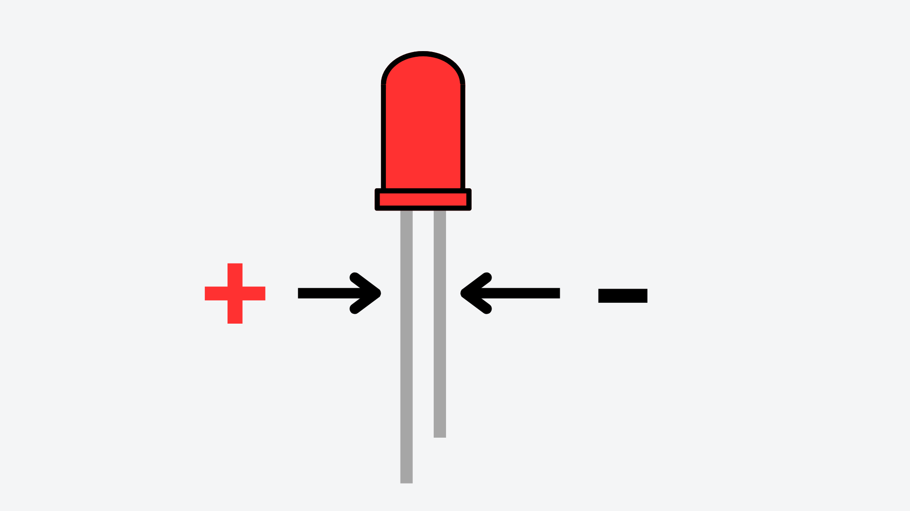
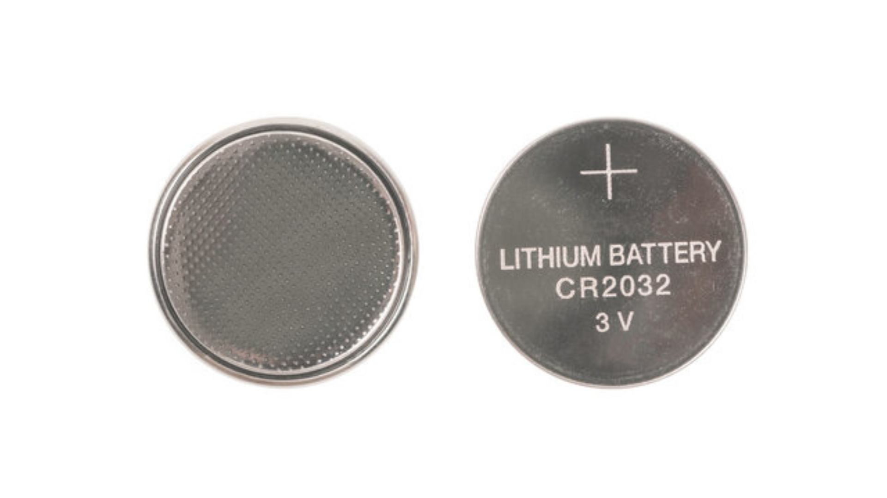
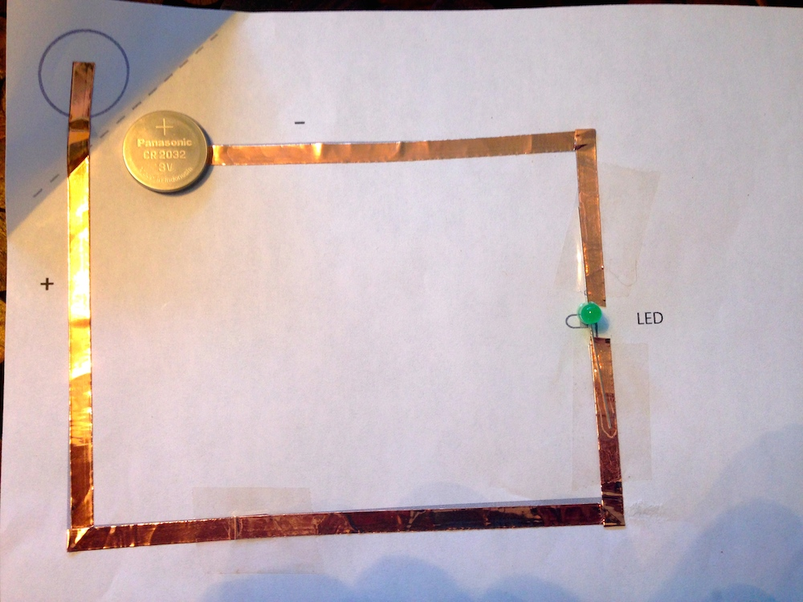
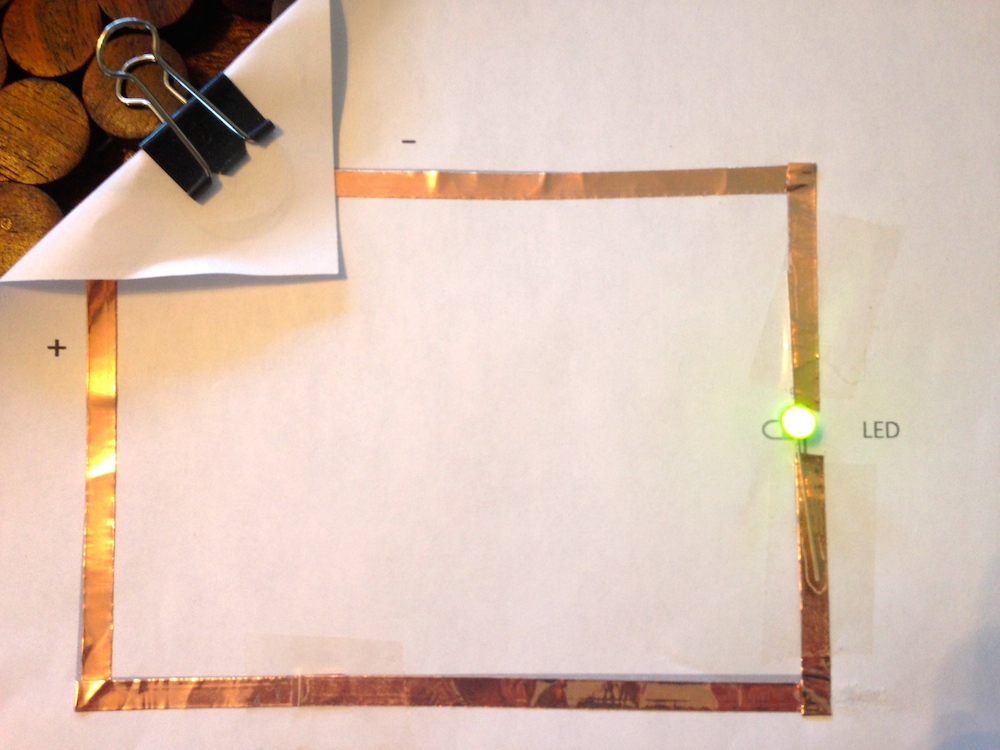
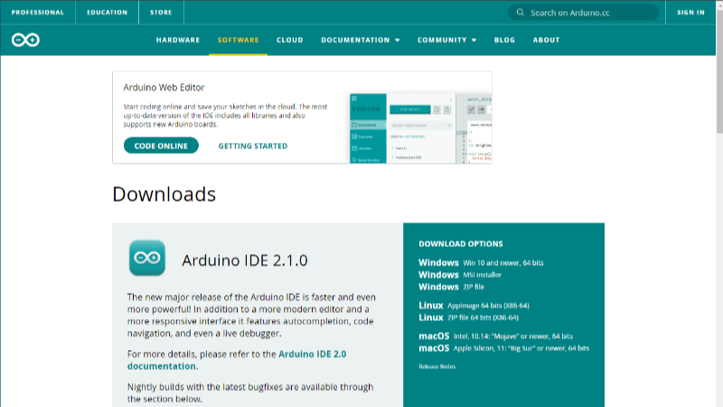

# Week 1

## Contents

- [Session Outline](#session-outline)
- [Code](#code)
- [Paper Circuits](#paper-circuits)
    - [Materials](#materials)
    - [LEDs](#leds)
    - [The Circuit](#the-circuit)
- [Arduino IDE](#arduino-ide)
    - [System Requirements](#system-requirements)
    - [Download](#download)

## Session Outline

Week 1's session will focus on creating a (very) simple sensor circuit and thinking about how we might be able to use it creatively.

We will also use this session to install the Arduino IDE in preparation for future sessions.

## Code

No code required this week!

## Paper Circuits

### Materials

You will need:
- 1x A4 sheet of paper
- 1x LED
- 1x 3V coin cell battery
- Copper or Aluminium foil tape (approx. 5mm wide)

### LEDs

An important thing to know about LEDs before you start is that they will only work one way around in a circuit. An LED has a ‘long leg’ and a short one. The longer one must be connected to the positive side of the battery.

### The Circuit

For the full instructions on how to make this circuit, visit the [Instructables page on Paper Circuits by tatiang](https://www.instructables.com/Paper-Circuits/).

*Images taken from: https://www.instructables.com/Paper-Circuits/*

## Arduino IDE
### System Requirements
To install and run the Arduino IDE 2.x (newest version), it is suggested that you use a computer that runs:

- Windows 10 or newer.
- macOS 10.15 “Catalina” or newer.

At least 2GB of RAM is recommended, and the download (plus packages/libraries) requires about 400MB of storage space.

If you computer does not meet these requirements, you may be able to install an older version of the IDE (1.x) [from their website](https://docs.arduino.cc/software/ide-v1/tutorials/Environment/). This will give you all of the functionality you need, with a slightly less polished user interface.

### Download
You can install the Arduino IDE from [the software page on their website](https://www.arduino.cc/en/software). From there, you will need to select the correct download for your computer's operating system (i.e. Windows 10/MacOS/etc) and follow the download instructions.

