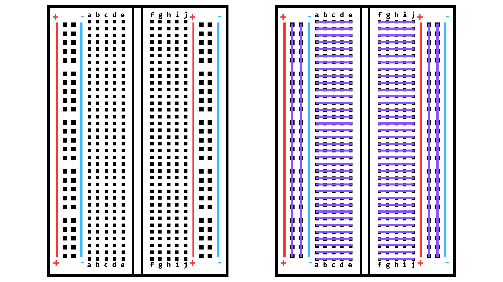
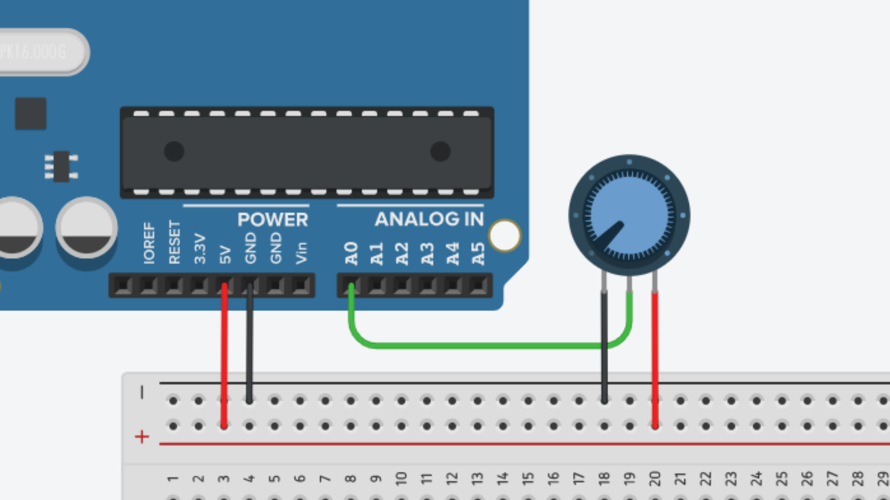
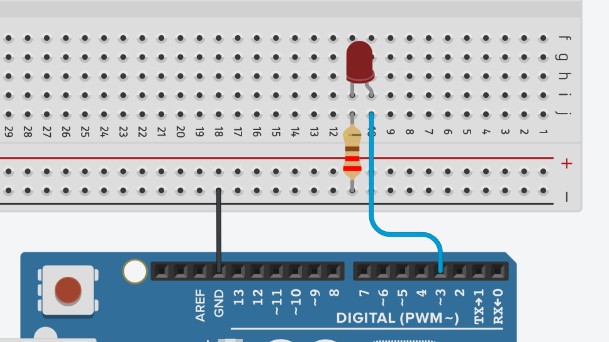
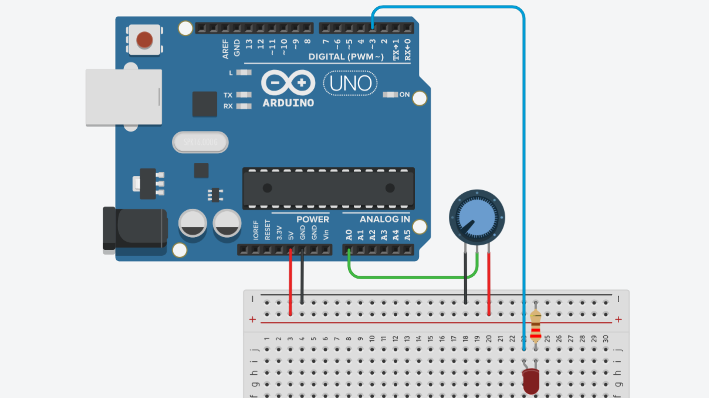

# Week 2

## Contents

- [Session Outline](#session-outline)
- [Code](#code)
    - [For class](#code-for-class)
    - [Other examples](#other-examples)
- [Wiring Diagrams](#wiring-diagrams)
    - [Breadboard](#breadboard)
    - [Potentiometer Circuit](#potentiometer-circuit)
    - [LED Circuit](#led-circuit)
    - [Pot. & LED Circuit](#potentiometer-and-led-circuit)

## Session Outline

Week 2's session will introduce breadboarding and creating simple potentiometer/LED circuits with an Arduino and a breadboard.

## Code

### Code for class:

- [Pot_Read.ino](./Pot_Read.ino)
- [LED_Fade.ino](./LED_Fade.ino)
- [Pot_LED_Blinker.ino](./Pot_LED_Blinker.ino)

### Other Examples

- [LED_Blink.ino](./LED_Blink.ino)
- [Pot_LED_Fader.ino](./Pot_LED_Fader.ino)
- [Pot_LED_Selector.ino](./Pot_LED_Selector.ino)
- [Pot_LED_CrossFade.ino](./Pot_LED_CrossFade.ino)

## Wiring Diagrams

### Breadboard

### Potentiometer Circuit

### LED Circuit

*The LED should be connected to a PWM pin for these examples. PWM pins are marked on the Arduino with a ~ symbol. Pins 3, 5, 6, 9, 10 and 11 are the PWM pins on the Arduino UNO.*

*You will also need a 220Ω resistor to limit the current flowing through the LED.*

### Potentiometer and LED Circuit

*Again, you will need to place a 220Ω resistor in series with the LED.*