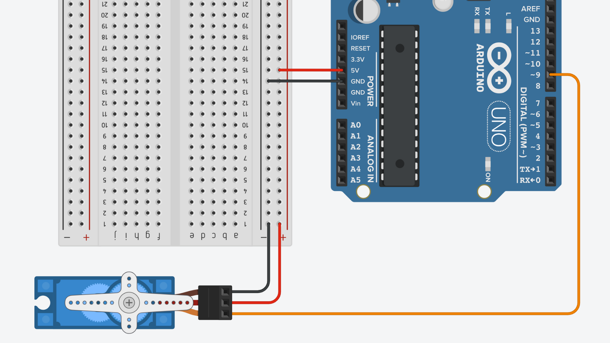
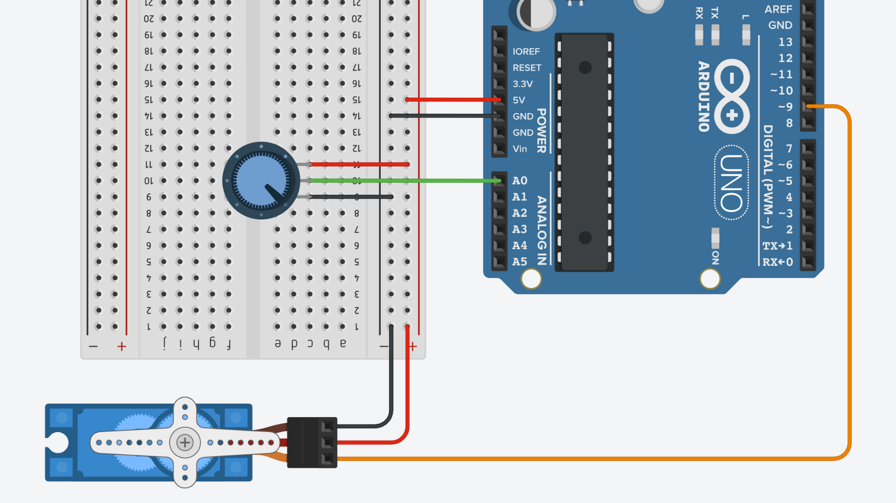
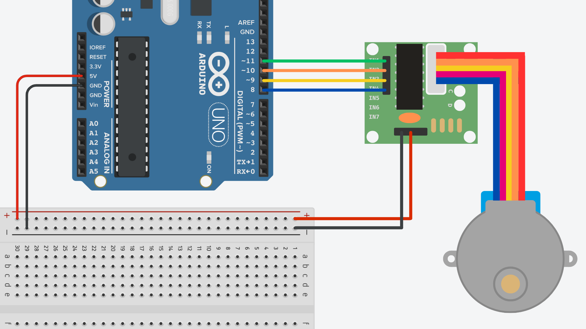
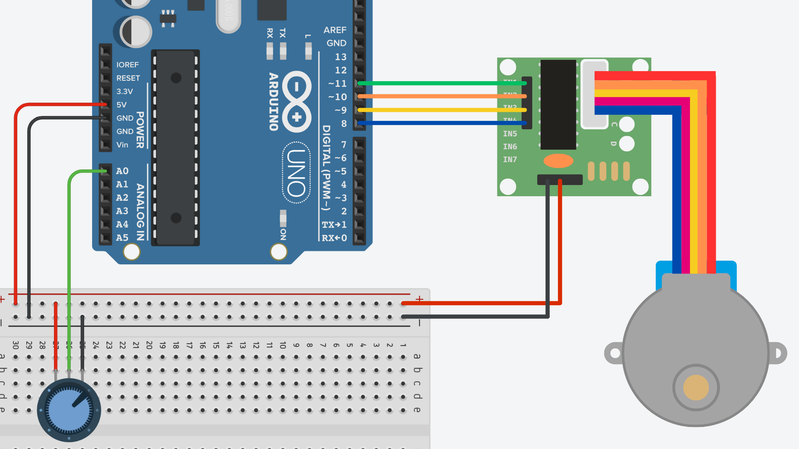

# Week 3

## Contents

- [Session Outline](#session-outline)
- [Code](#code)
    - [For class](#code-for-class)
    - [Other examples](#other-examples)
- [Wiring Diagrams](#wiring-diagrams)

## Session Outline

Week 3's session will focus on incorporating movement into Arduino projects. We will be looking at servo and stepper motors and how to use them with Arduino.

## Code

### Servo

- [Servo_Analog_Position.ino](./Servo_Analog_Position.ino)

- [Servo_Analog_SelectMovement.ino](./Servo_Analog_SelectMovement.ino)
- [Servo_Analog_Speed.ino](./Servo_Analog_Speed.ino)
- [Servo_Sweep.ino](./Servo_Sweep.ino)

### Stepper

- [Stepper_Sweep.ino](./Stepper_Sweep.ino)

- [Stepper_Analog_Position.ino](./Stepper_Analog_Position.ino)
- [Stepper_Analog_Speed.ino](./Stepper_Analog_Speed.ino)

## Wiring Diagrams

### Servo

### Servo w/ Potentiometer

### Stepper

### Stepper w/ Potentiometer

