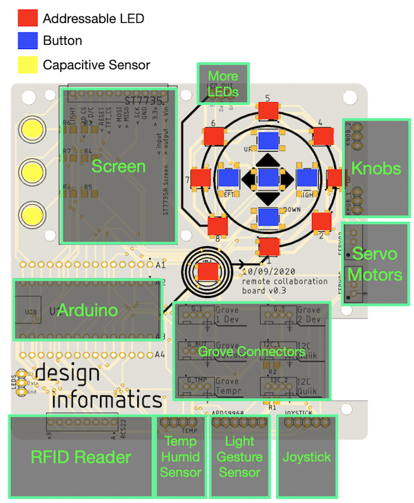

# Week 5

## Contents

- [Session Outline](#session-outline)
- [Design Informatics PCB](#design-informatics-pcb)
- [Code](#code)

## Session Outline

Week 5's session will introduce at the Arduino Nano IoT 33 board with the Design Informatics PCB. We will also look in more detail at using NeoPixel LEDs with Arduino.

## Design Informatics PCB

You can find more info on the Design Informatics PCB [here](https://github.com/Edinburgh-College-of-Art/DesignInformaticsPCB/tree/master).

## Code

- [NeoPixel Light Meter](./DIBoard_GroveLight_NeoPixel.ino)
- [NeoPixel Sound Meter](./DIBoard_GroveSound_NeoPixel.ino)

You can find additional example code for the DI board in *File > Examples > Design Informatics Base*. 
